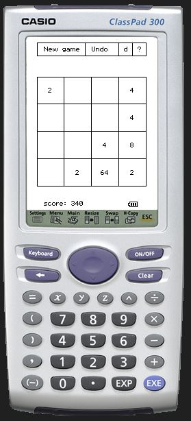

# g2048

Simple implemetation of the game 2048 for the Casio ClassPad 330.

Compiled on Windows 7 using Bloodshed Dev-Cpp that comes with ClassPad SDK.

Controls: Sliding by either arrow keys, 8456 or drag gestures. Undo by Backspace key or by clicking undo button.

